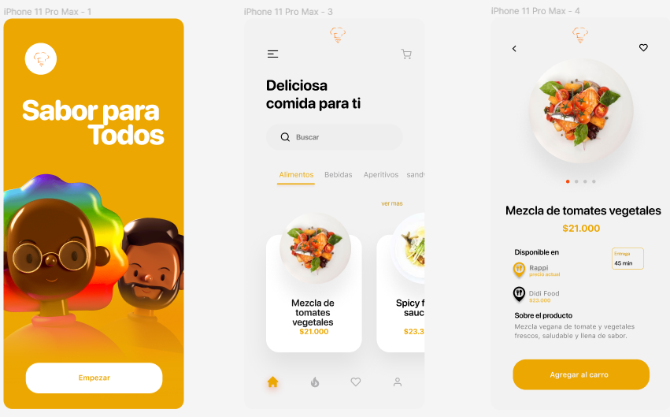

# FoodCompare

  

    
  

  
<i>
    FoodCompare
  </i>

## Purpose

The **FoodCompare** software will enable users to compare food offers from various online platforms to find the best options that meet their nutritional needs. The application gathers information about food sales from multiple *e-commerce* sites and online supermarkets, **comparing them based on prices, quality, ratings, and other relevant criteria.**

The application's functionality allows users to search for specific foods and view different available options online, along with detailed information on price, estimated delivery time, seller, and user ratings. Additionally, users can apply filters based on preferences such as brand, food type, dietary restrictions, and other relevant criteria to personalize their experience.

**FoodCompare** also empowers users to rate the service quality and food quality of different online vendors, enabling them to share experiences and assist others in making informed decisions on where to purchase their food online.

The application's primary focus is to provide accurate and up-to-date information on online food sales, helping users make informed decisions to meet their nutritional needs. It is important to note that **FoodCompare** does not offer food delivery services nor does it control the quality of the food sold by vendors.

## Version

The current version of the application is **1.0.0**.

## How to start this project

This project was developed using Java and Maven, so Java and Maven must be installed to run it successfully. Additionally, it utilizes the MongoDB library for establishing a connection to the cluster. The folder and file configuration were set up using IntelliJ's generator, hence it is recommended to use IntelliJ for this project.

so, u need: Java, Maven, MongoDB, IntelliJ

## Authors

Fabian Perez , Miguel Angel

## User Instructions

To get this project up and running, follow these steps:

1. Open the project in IntelliJ.
2. Provide a link to connect to a MongoDB cluster in your code (usually in a configuration file or as a connection string).
3. Build the project to ensure all dependencies are resolved.
4. Run the project to execute the application.

## Mockups

Three mockups were created for the design of this project. Below are the visuals of the mockups, and the Figma link can be accessed [here](https://www.figma.com/file/STpkEMb38OOGCil94pZUCj/Mockup-Software-1?type=design&node-id=0%3A1&mode=design&t=oo5AwfTwXwHXI8jT-1).

